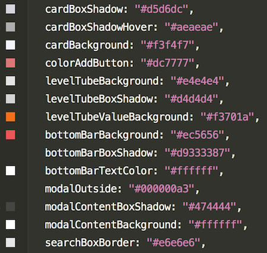

# AppMan Pokédex (My Pokémon cards list)
### (*** Limit Time: 3 hours.)

We want you to build a web application with the following requirements:

| User Story | Acceptance Criteria |
|:---|:---|
|As a user, I want to see my Pokédex, so that I can build a list of Pokémon cards that I like.|- I can see the list of my Pokémon cards. - I can add a Pokémon card to my Pokédex from search result list. - I can remove a Pokémon card from my Pokédex.|
|As a user, I want to be able to search for a Pokémon card, so that I can add it into my Pokédex.|- I can search based on Pokémon name. - I can search based on Pokémon type.|
|As a user, I want to see only unselected Pokémon cards on the search list, so that I can select a different Pokémon card.|- I can see only unselect Pokémon cards on the result list.|
|As a user, I want to cancel adding a Pokémon to my Pokédex, so that I can close the Pokémon list modal.|- I can close the Pokémon list modal by clicking outside.|
|As a user, I want to see the details of each Pokémon, so that I can see the abilities of a Pokémon.|- I can see HP level of a Pokémon. - I can see Strength level of a Pokémon. - I can see Weakness level of a Pokémon. - I can see Happiness level of a Pokémon.|

## Limitation
- Good news!! Support only on iPad (1024x768) screen size :)) no RESPONSIVE!!

## Also, we already prepared some stuff for you!!! :D

### 1. Base project (includes iPad layout screen, so cool!!)

### 2. Service API
  - You can run service api by `yarn run api`
  - The endpoint to get Pokémon list is `[GET]http://localhost:3030/api/cards`
  - query
    - limit: default 20 item/
    - name: search monster by name
    - type: search monster by type
    - example: http://localhost:3030/api/cards?limit=30&name=picha&type=normal

### 3. How to calculate `HP level`, `Strength level`, `Weakness level` and `Happiness level`.

  - HP level calculation
      - maximum is 100. if value is higher than 100 set it to 100, otherwise 0.
  - Strength level calculation
      - use `attacks` length to multiply by 50, maximum is 100. e.g. if value is 1 set it to 50, 2 set it to 100, otherwise 0.
  - Weakness level calculation
      - use `weaknesses` length multiply by 100, maximum is 100. e.g. if value is 1 set it to 100, otherwise 0.
  - Damage calculation
      - use `damage` value without symbol of all attacks skill. e.g. 50+ set it to 50, 20* set it to 20, otherwise 0.
  - Happiness level calculation
      - ((HP / 10) + (Damage /10 ) + 10 - (Weakness)) / 5
      
  #### Example
    Pikachu {
      name: 'Pikachu',
      hp: 110,
      attacks: [
        { name: 'attack A', damage: '20+'},
        { name: 'attack B', damage: '40x'}
      ],
      weaknesses: [
        { name: 'weakness A'},
      ]
    }
  
    Output {
      hp: 100,
      strength: '100%',
      weakness: '50%',
      damage: 60,
      happiness: 5
    }
### 4. Interactive MockUp (as a .gif file)

### 5. Fonts (from Google Fonts)
  - `Atma:700`
  - `Gaegu`

### 6. Color codes

## How we score you??!!!
  - If you can complete all the requirements above, We surely score you 100!!!! NO reason!!
    - We will give you all the feedback later ;)
  - IF YOU FEEL LIKE SOMETHING IS MISSING, WE HAVE EXTRA SCORE FOR ANY ADDITIONAL THING YOU CAN PROVIDE. (Extra can be unit test, refactoring, performance tuning, etc. REMEMBER MAXIMUM IS NOT 100!!!)

If you have any questions, please do not hesitate to ask us anytime.
Wish you luck!! :)
